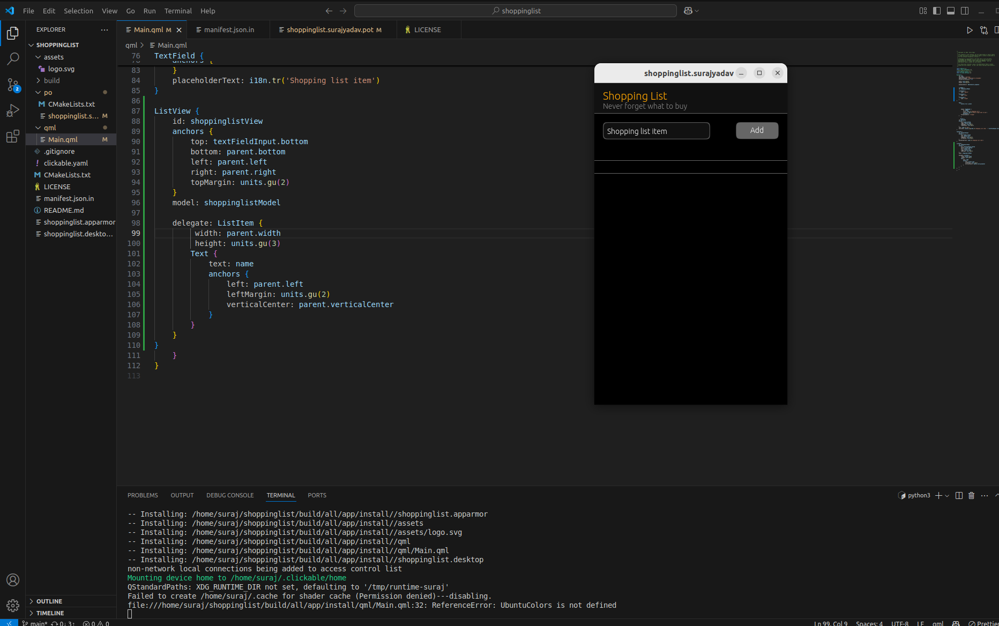
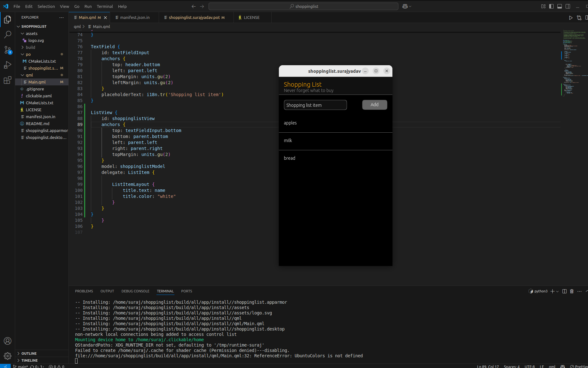
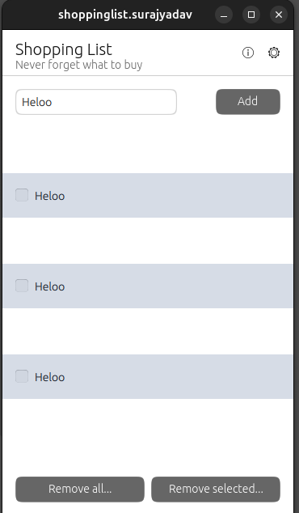

The UT Findings
===============


Module 1
--------

1. If the ``docker run hello-world`` does not work, without sudo.

   -  Solution

      1. First, check if the Docker group exists:

         .. code:: bash

            getent group docker

      2. If the Docker group doesn’t exist (unlikely since Docker
         typically creates it during installation), create it:

         .. code:: bash

            sudo groupadd docker

      3. Add your user to the Docker group:

         .. code:: bash

            sudo usermod -aG docker $USER

      4. Apply the new group membership by either:

         -  Logging out and back in, or

         -  Running this command to apply changes to your current
            session:

            .. code:: bash

               newgrp docker

      5. Verify that you can run Docker without sudo:

         .. code:: bash

            docker run hello-world

      If you’re still having permission issues, you might need to:

      -  Check Docker service status: ``sudo systemctl status docker``
      -  Restart Docker: ``sudo systemctl restart docker``
      -  In some cases, a system reboot might be needed

      This solution adds your user to the Docker group, which gives you
      permission to use the Docker socket without needing sudo
      privileges. Keep in mind that this effectively grants your user
      root-equivalent permissions for Docker operations, so ensure you
      understand the security implications.

  

2. The Docker installation does not work. The rest of the Packages can
   be installed but not docker. So as Mentioned in the Documentation
   Visit the Official Docker Website and Follow the Instructions .

   -  Solution

      1. Uninstall all the docker packages to avoid the Conflict. The
         instruction is given at the official Docker Website.

      .. code:: bash

         for pkg in docker.io docker-doc docker-compose docker-compose-v2 podman-docker containerd runc; do sudo apt-get remove $pkg; done

      2. Setup the Docker’s apt repository and Install Docker through
         apt or its Desktop application.

      .. code:: bash

         sudo apt-get install docker-ce docker-ce-cli containerd.io docker-buildx-plugin docker-compose-plugin

      3. Verify that the installation is successful by running the
         ``hello-world`` image:

         .. code:: bash

            sudo docker hello-world

--------------

Module 2
--------

1. Not able to reflect any changes from the QML file to Emulator or
   Device.

-  Solution

   Manually Press ctrl + s or Turn on Auto Save in VS Code

--------------

2. Not able to Change the Foreground Color in the PageHeader

   -  Solution

      1. Use

      .. code:: jsx

         StyleHints {        foregroundColor: "orange"    }

--------------

3. Issue with the ListView delegate , ListItem are not displayed





-  Solution

   1. The height you set for the ListItem is quite small at 3 grid
      units.
   2. In Ubuntu Touch/Lomiri, ListItem has specific styling and expects
      certain properties. The Text component might not be appearing
      because ListItem has its own layout system.

   .. code:: jsx

      ListView {
          id: shoppinglistView
          anchors {
              top: textFieldInput.bottom
              bottom: parent.bottom
              left: parent.left
              right: parent.right
              topMargin: units.gu(2)
          }
          model: shoppinglistModel
          delegate: ListItem {
              // Remove fixed height to let it size naturally
              ListItemLayout {
                  title.text: name  // This is the proper way to display text in a ListItem
                  title.color: "white"  // Make text visible against the dark background
              }
          }
      }




--------------

Module 3
--------


1. UBports API Links All Redirect to Same Page

**Observation:**
    Links lack specificity; this undermines documentation clarity.

**Recommended Action:**
    Validate, update, and contextualize all links to relevant API sections.

---

2. The Buttons in the Row are not working. → 3.4 in the Docs


-  Solution 3.4

   The buttons inside the ``Row`` layout at the bottom may not be
   functioning as expected due to conflicts with the ``ListView``
   layout constraints**, z-index, or overlapping items.

   Update the ``ListView``\ ’s `bottom` anchor to stop before hitting
   the ``Row``:

   .. code:: jsx

      bottom: buttonRemoveAll.top

--------------

Module 4
--------

1. Odd Rows Become Invisible during 5.1 while Creating Property for
   Selection Mode



  :alt: Alternative text

-  Solution to 5.1

   The root cause of odd-numbered rows appearing *invisible* in your
   ``ListView`` implementation stems from the improper layering of the
   ``Rectangle`` that is intended to alternate the row background color.
   Here’s the Corrected Code

   .. code:: jsx

      delegate: ListItem {
          Rectangle {
              anchors.fill: parent
              z: -1  // explicitly set z-index to ensure it's beneath
              color: index % 2 ? theme.palette.normal.selection : theme.palette.normal.background
          }

          leadingActions: ListItemActions {
              actions: [
                  Action {
                      iconName: "delete"
                      onTriggered: shoppinglistModel.remove(index)
                  }
              ]
          }

          trailingActions: ListItemActions {
              actions: [
                  Action {
                      iconName: "info"
                      onTriggered: console.log(i18n.tr("Info trailing button pressed"))
                  }
              ]
          }

          CheckBox {
              id: itemCheckbox
              visible: root.selectionMode
              anchors {
                  left: parent.left
                  leftMargin: units.gu(2)
                  verticalCenter: parent.verticalCenter
              }
          }

          Text {
              id: itemText
              text : name
              anchors {
                  left: root.selectionMode ? itemCheckbox.right : parent.left
                  leftMargin: root.selectionMode ? units.gu(1) : units.gu(2)
                  verticalCenter: parent.verticalCenter
              }
          }
      }

--------------

1. Text of Listview is not properly visible in dark Mode

-  Solution

   In dark mode, the default system might be setting text to a dark
   color, which would be invisible against a dark background.

   To fix this issue, you should:

   1. Either explicitly set the text color to match your theme
   2. Or better, use Lomiri Components’ Label instead of Text to
      automatically handle theming

   Here’s how you could fix it:

   .. code:: jsx

      // Option 1: Explicitly set color
      Text {
          id: itemText
          text: name
          color: theme.palette.normal.baseText  // Use theme colors
          anchors {
              left: root.selectionMode ? itemCheckbox.right : parent.left
              leftMargin: root.selectionMode ? units.gu(1) : units.gu(2)
              verticalCenter: parent.verticalCenter
          }
      }

      Text {
          text: price
          color: theme.palette.normal.baseText  // Use theme colors
          anchors {
              right: parent.right
              rightMargin: units.gu(2)
              verticalCenter: parent.verticalCenter
          }
      }

      // Option 2: Use Label instead (preferred approach)
      Label {
          id: itemText
          text: name
          anchors {
              left: root.selectionMode ? itemCheckbox.right : parent.left
              leftMargin: root.selectionMode ? units.gu(1) : units.gu(2)
              verticalCenter: parent.verticalCenter
          }
      }

      Label {
          text: price
          anchors {
              right: parent.right
              rightMargin: units.gu(2)
              verticalCenter: parent.verticalCenter
          }
      }

--------------

Module 5
--------

1. While Setting the SQL Data base when you run this command

``SELECT rowid, name, selected FROM ShoppingList;`` and Do not see the
Entire List . Do not panic , You Can add the items manually. - Sulution

::

   ```sql
   INSERT INTO ShoppingList (name, selected) 
   VALUES 
       ("water", false),
       ("bread", false),
       ("bananas", true),
       ("milk", false);
   ```

--------------

2. Mouse Area Not Working Properly while adding the new function to
   Mouse Area

-  Solution

   The ``onClicked`` handler is defined as a function but it’s missing
   the parameter for the function to properly work.

   Here are the problems:

   1. The ``onClicked`` handler is set up as a function named
      ``toggleSelectionStatus``, but it’s not being called anywhere
   2. The function expects an ``index`` parameter, but there’s no index
      being passed to it
   3. The MouseArea’s onClicked doesn’t automatically provide an index
      parameter

   The correct implementation should either:

   -  Call the function inside the onClicked handler, or
   -  Simply use onClicked as a direct handler without defining it as a
      named function

   Here’s how you could fix it:

   .. code:: jsx

      MouseArea {
          anchors.fill: parent
          onPressAndHold: root.selectionMode = true
          onClicked: {
              if (root.selectionMode) {
                  var rowid = shoppinglistModel.get(index).rowid;
                  var selected = !shoppinglistModel.get(index).selected;
                  db.transaction(function (tx) {
                      tx.executeSql('UPDATE ' + shoppingListTable + ' SET selected=? WHERE rowid=?', [Boolean(selected), rowid]);
                  });
                  shoppinglistModel.get(index).selected = selected;
                  shoppinglistView.refresh();
              }
          }
      }

--------------

Module 6
--------

1. If You face problem while installing flask with

``pip3 install Flask`` , try using pipx or python3 install flask -
Solution

::

   ```bash
   pipx install flask
   ```


--------------


No Errors were Found in 7th and 8th Module

